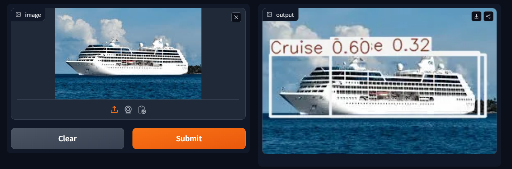
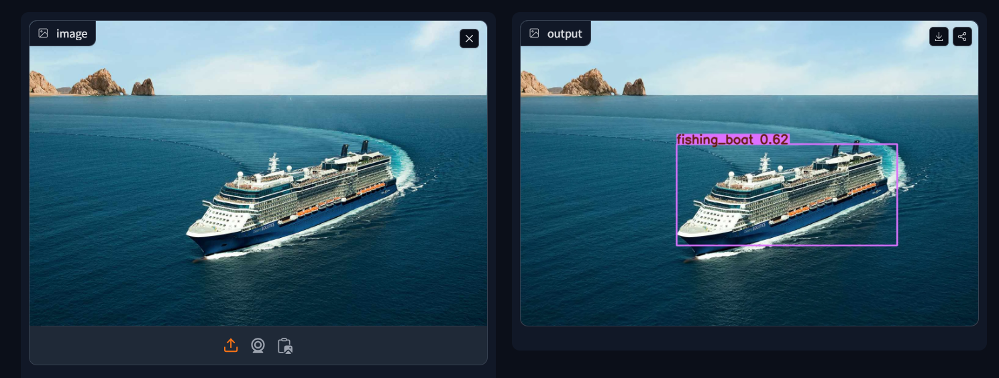
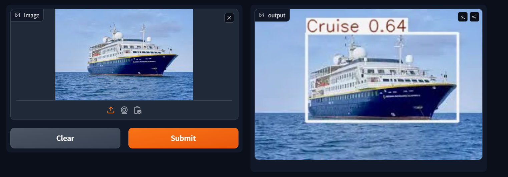

# 🚢 Object Detection Using YOLO 🚢  

This project utilizes the **YOLO v8** object detection model to identify the position of **ships** in the sea. The model has been trained on a dataset of ship images, ensuring high accuracy, especially for detecting large ships.  

📌 **Dataset Source:** The dataset was collected from **Roboflow**.  

📌 **Gradio Interface:** The project includes a **Gradio-based UI**, allowing users to upload images and view predictions in real time.  

---

## 📂 Project Structure  

Ensure all files are placed within the **same folder** for proper execution.  

- `app.py` → Main file to launch the Gradio interface  
- `model.pth` → Pre-trained YOLO v8 model  
- `requirements.txt` → List of dependencies  
- `images/` → Folder containing sample output screenshots  

---
## Screenshots  

Here are some screenshots of the website pages:  

### Prediction 1 
  

### Prediction 2  
  

### Prediction 3


## ⚙️ Installation and Setup  

### 1️⃣ **Install Dependencies**  
Before running the project, install the required dependencies:  
```sh
pip install -r requirements.txt
